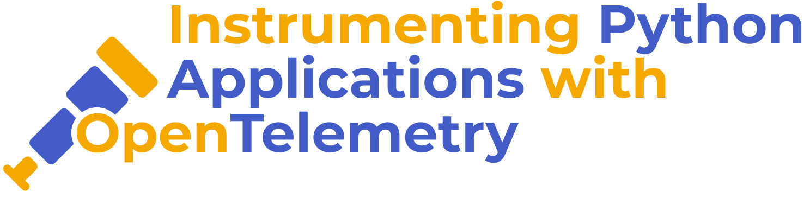
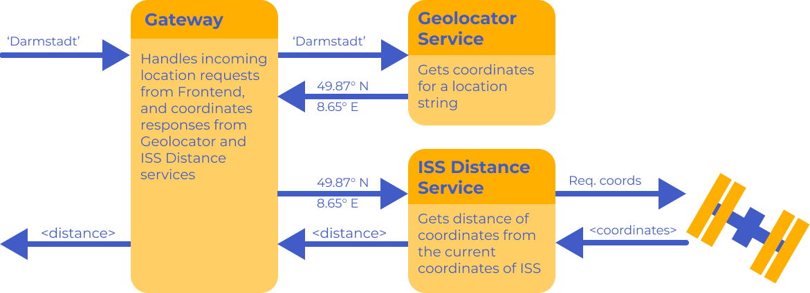

#  

## 

### Objective

- Instrument an existing service with logs, metrics and traces using OpenTelemetry
- Send OpenTelemetry data to a set of telemetry backends
- Use UIs to explore and make sense of observability data

### Agenda

1. Introduction to Observability and OpenTelemetry
1. Tour of the Application and Tooling
1. Instrument a service in the application
    1. Logging
    1. Metrics
    1. Tracing
1. Tie everything together

### Prerequisites

All you need is `docker-compose` installed since we'll be using this to run and orchestrate the services and infrastructure.
You don't even need to have a particular version of Python installed on your machine.

## 

For this workshop, we will use a suite of services to build our telemetry platform:

- [Prometheus](https://prometheus.io/) for metrics.
- [Loki](https://grafana.com/oss/loki/) for logging.
- [Jaeger](https://www.jaegertracing.io/) and [Tempo](https://grafana.com/docs/tempo/latest/) for tracing.

To start the telemetry platform using [Docker Compose](https://docs.docker.com/compose/), run the following:

```sh
> docker-compose up -d
```

This will start the above services in the background, you can check on their status by running `docker ps`.

The UIs for these services will then be accessable at:

- Prometheus - <http://localhost:9090>
- Jaeger - <http://localhost:16686>
- Grafana - <http://localhost:3000>

To pause the backends, run:

```sh
> docker-compose stop
```

To remove the backends and their containers, run:

```sh
> docker-compose down
```

## 



This workshop revolves around instrumenting an example microservice application. This application
allows a user to determine the distance of a location from the current location of the
International Space Station. It is composed of the following services:

- `frontend` - The frontend service that calls out to the `gateway`.
- `backend/gateway` - The gateway service that handles requests from the `frontend`.
- `backend/geolocator-service` - A service that takes in a location string, and attempts
  to return the coordinates for that location.
- `backend/iss-distance-service` - A service that takes in a coordinate, gets the current
  location of the International Space Station, and returns the distance of the ISS from the
  given coordinates.

To build and start the services:

```sh
> docker-compose -f docker-compose-services.yml up --build
```

To start the services in **watch** mode, so that they are rebuilt and restarted on
code changes, run:

```sh
> docker-compose -f docker-compose-services.yml watch
```

After either of these, the frontend will be available at <http://localhost:5000>.

To stop the services, run:

```
> docker-compose -f docker-compose-services.yml down
```

---

## 

Sections 1-3 will involve instrumenting just one of the services, the `iss-distance-service`. In Section 4
we'll tie everything together and instrument across all four services.

### Section 0: Create an OpenTelemetry Resource

The first thing we'll need to do is put the setup in place to support instrumenting with OpenTelemetry.

In an editor, open up `backend/iss-distance-service/app.py`.

Instrumenting a service starts with creating an OTel `Resource`. A `Resource` is a representation of the entity producing telemetry, i.e. a representation of the service which produces the metrics, traces and/or logs, which in this case is the `iss-distance-service`.  

To define a resource for our service, begin by importing the following:

```python
from opentelemetry.sdk.resources import (
    DEPLOYMENT_ENVIRONMENT,
    SERVICE_NAME,
    Resource,
)
```
Then, towards the top of the file, add the following resource and set the values:

```python
resource = Resource(
    attributes={
        SERVICE_NAME: "iss-distance-service",
        DEPLOYMENT_ENVIRONMENT: "dev",
    }
)
```

This creates a resource, and provides further context about it using `attributes`. These attributes that we set on the resource are applicable to the service as a whole and will be relevant
to all telemetry exported e.g., we can set things such as the service name, version, environment. 

We will later use this resource when initialising metrics, logging and tracing.

### Section 1: Metrics

#### i. Set up metric

Before we can begin creating and exporting metrics, we need to do some setup.

Again, open up `backend/iss-distance-service/app.py`.

Add the following to the list of imports (each of these imports will be explained when we use them):

```python
from opentelemetry.exporter.otlp.proto.grpc.metric_exporter import (
    OTLPMetricExporter,
)
from opentelemetry.metrics import (
    get_meter_provider,
    set_meter_provider,
)
from opentelemetry.sdk.metrics import MeterProvider
from opentelemetry.sdk.metrics.export import PeriodicExportingMetricReader
```

First we use these imports to set up a metrics `exporter` and `provider`:

```python
exporter = OTLPMetricExporter(insecure=True)
reader = PeriodicExportingMetricReader(exporter)
provider = MeterProvider(resource=resource, metric_readers=[reader])
set_meter_provider(provider)
```

This sets up the OTLP exporter to send metrics over OTLP to a backend (in our case the OpenTelemetry Collector). Setting `insecure=True` means it will send data over HTTP rather than HTTPS. The `MetricReader` exports metrics periodically. The `MeterProvider` manages the metrics meters and receives the resource that was created in Section 0. Finally we set the meter provider as the global provider, which allows the rest of our service to make use of it. 

Next, we get a `meter`, which will be used to generate metrics:

```python
meter = get_meter_provider().get_meter(__name__)
```

#### ii. Create metrics

There are several different types of metrics that can be created, such as counters, histograms and gauges. In this section, we will focus on creating a counter, but we encourage you to explore all metric types. 

Directly below where you have defined the `meter`, create the following `counters` which will be used to count requests; one counter to count incoming requests received by the service, and the other to count outgoing requests to the ISS endpoint.

```python
incoming_request_counter = meter.create_counter(
    "incoming.requests",
    description="the number of requests made to the service",
)
iss_request_counter = meter.create_counter(
    "iss.requests",
    description="the number of requests made to iss endpoint",
)
```

Then use the counters to generate metrics by adding the following,

In the `api()` method:


```python
incoming_request_counter.add(1)
```

In the `get_iss_coordinates()` method, after the request is made:

```python
iss_request_counter.add(1, {"response.status": r.status_code})
```


#### iii. Explore metrics with Grafana and Prometheus

TODO: add some screenshots

### Section 2: Logging

#### i. Set up logging

Again, some setup is required before we can create logs. 

Open up `backend/iss-distance-service/app.py` and add the following to the list of imports:

```python
import logging

from opentelemetry._logs import set_logger_provider
from opentelemetry.exporter.otlp.proto.grpc._log_exporter import (
    OTLPLogExporter,
)
from opentelemetry.sdk._logs import LoggerProvider, LoggingHandler
from opentelemetry.sdk._logs.export import SimpleLogRecordProcessor
```

Then, we'll then use these imports to set up the log `provider` and `exporter`. Underneath `app = Flask(__name__)` add the following to set up the logging provider.

```python
logger_provider = LoggerProvider(resource=resource)
set_logger_provider(logger_provider)
```

This creates a `LoggerProvider`, and registers it so the logger provider can be used.

Next we set up the OTLP exporter to send logs over OTLP. We also set up a logging handler which sends Python logs to OTel's logging system.

```python
exporter = OTLPLogExporter(insecure=True)
handler = LoggingHandler(level=logging.NOTSET, logger_provider=logger_provider)
logger_provider.add_log_record_processor(SimpleLogRecordProcessor(exporter))

console_handler = logging.StreamHandler()
console_handler.setLevel(logging.INFO)
logging.getLogger().addHandler(console_handler)`
```

In this step the `console_handler` is used to output logs to stdout/stderr for the purposes of debugging. This means that we'll send logs to both the telemetry backend and to the console.

Lastly create and configure the OpenTelemetry logger for the service:

```python
otel_logger = logging.getLogger(__name__)
otel_logger.addHandler(handler)
otel_logger.level = logging.DEBUG
```

This attaches the OTLP handler to root logger and creates a namespaced logger. It hooks the standard Python logger into OpenTelemetry and captures all logs at level `DEBUG` and above.

#### ii. Create logs

Add logs to the following points in the code to record particular events:

1. When the application is started: `otel_logger.info("started application")`
2. When no latitude or longitude is provided in the request: `otel_logger.warning("Missing latitude/longitude in request")`
3. When an incoming request is received: `otel_logger.info("received request from IP address: %s", request.remote_addr)`
4. When a non-200 response is returned from the ISS endpoint: `otel_logger.error("request to iss endpoint returned a non-200 response")`

#### iii. Explore logs with Grafana and Loki

TODO: Add screenshots

### Section 3: Tracing

#### i. Set up tracing

Like in the previous sections, we'll need to do some setup, before we can create traces.

Again, open up `backend/iss-distance-service/app.py`, and add the following to the list of imports:

```python
from opentelemetry import trace
from opentelemetry.exporter.otlp.proto.grpc.trace_exporter import OTLPSpanExporter
from opentelemetry.sdk.trace import TracerProvider
from opentelemetry.sdk.trace.export import SimpleSpanProcessor
```

Then, we'll then use these imports to set up the tracing `exporter` and `provider`. Underneath `app = Flask(__name__)` add the following:

```python
span_exporter = OTLPSpanExporter()

span_processor = SimpleSpanProcessor(span_exporter)
trace_provider = TracerProvider(resource=resource)
trace_provider.add_span_processor(span_processor)

trace.set_tracer_provider(trace_provider)
```

This is a lot of new additions in just a few short lines! Let's pause to take a look at what do each of these does: 

- `OTLPSpanExporter` - this is a span exporter. It exports spans to the OpenTelemetry Collector using the OpenTelemetry Protocol (OTLP).
- `TracerProvider` - the provider manages and provides a `tracer` instance. This is used to create spans for distributed tracing.
- `SimpleSpanProcessor` - the span processor exports spans to the `OTLPSpanExporter`. It exports them immediately as they're generated. We use this form of `Processor` for simplicity, but in production applications, you would typically use a `BatchSpanProcessor`.

After that we can set up the `tracer`, which will be used to create spans:

```python
tracer = trace.get_tracer_provider().get_tracer(__name__)
```

#### ii. Create spans

Now that we have the setup in place, we can begin capturing useful information.

On the `api` function, we can create the first `span`.

A `trace` represents a journey through the application. It provides a wide view of the journey taken through the code and services. It is comprised of spans.
A `span` represents a single event that occurs as part of journey through the application e.g a span can represent a HTTP request to other microservices or 3rd parties, database queries. Together, spans build traces.

We would like to know when a request is made to the `iss-distance-service`, and how long the request takes.

There are two ways to capture an OpenTelemtry span i. using a method decorator or ii. using `with`. In this example we will use both.

Add the following `with` block to the `api` method, giving the span a suitable name e.g. `"calculating-api-distance"`:

```python
def api():
    with tracer.start_as_current_span("<PLACEHOLDER-SPAN-NAME>") as span:
      ...
```

We would also like to know when a request is made to the `iss_now` API. To know this, we will create a span when this is called. Add the following decorator to the `get_iss_coordinates` method, giving the span a suitable name e.g. `getting-iss-coordinates`, in order to create a `nested span`:

```python
@tracer.start_as_current_span("<PLACEHOLDER-SPAN-NAME>")
def get_iss_coordinates() -> Coordinates:
```

#### iii. Add span attributes

Attributes can be used to add additional metadata information to a span. This information can then be used
when exploring traces and allows you to do things such as grouping or filtering.

If the status code from the request to get the ISS coordinates is successful, we
can set a `span attribute` to capture the coordinates returned:

```python
if r.status_code == 200:
    ...

    span = trace.get_current_span()
    if position:
        coordinates = Coordinates(float(position.get("latitude")), float(position.get("longitude")))
        span.set_attribute("iss.position", str(coordinates))
        return coordinates
```

Because there are some forms of data that are typically useful to capture, there
are `Semantic Attributes` which allow the attributes to be defined in a consistent way. We will use semantic attributes to capture the request method, status and url:

Import the following:
```python
from opentelemetry.semconv.trace import SpanAttributes
```

Add the following after the request is made:

```python
current_span.set_attribute(SpanAttributes.HTTP_METHOD, "GET")
current_span.set_attribute(SpanAttributes.HTTP_STATUS, r.status_code)
current_span.set_attribute(SpanAttributes.HTTP_URL, iss_now_url)
```

Finally, we can handle error cases by setting a span status:

```python

if latitude and longitude:
    ...
    return ...

else:
    span.set_status(trace.StatusCode.ERROR)
    return ...

```

#### iv. Explore traces with Grafana and Tempo

TODO: Add screenshots

### Section 4: Tying it all together

#### Propagating traces between services

### Wrap-Up


