#  

## 

### Objective

- Instrument an existing service with logs, metrics and traces using OpenTelemetry (also referred to as OTel)
- Send OpenTelemetry data to a set of telemetry backends
- Use UIs to explore and make sense of observability data

### Agenda

1. Introduction to Observability and OpenTelemetry
2. Tour of the Application and Tooling
3. Instrument a service in the application
    1. [Logging](#section-1-logging)
    1. [Metrics](#section-2-metrics)
    1. [Tracing](#section-3-tracing)
4. [Distributed tracing](#section-4-distributed-tracing)

### Useful Resources

- [OpenTelemetry documentation](https://opentelemetry.io/docs/)
    - [Concepts](https://opentelemetry.io/docs/concepts/)
    - [Python](https://opentelemetry.io/docs/languages/python/)
- [OpenTelemetry Python SDK](https://github.com/open-telemetry/opentelemetry-python)
    - [Examples](https://github.com/open-telemetry/opentelemetry-python/tree/main/docs/examples)
    - [API Reference](https://opentelemetry-python.readthedocs.io/en/latest/)
- OpenTelemetry Autoinstrumentation
    - [Flask](https://opentelemetry-python-contrib.readthedocs.io/en/latest/instrumentation/flask/flask.html)
    - [Requests](https://opentelemetry-python-contrib.readthedocs.io/en/latest/instrumentation/requests/requests.html)

### Prerequisites

All you need is `docker` installed since we'll be using this to run and orchestrate the services and infrastructure.
You don't even need to have a particular version of Python installed on your machine.

## 

For this workshop, we will use a suite of services to build our telemetry platform:

- [Prometheus](https://prometheus.io/) for metrics.
- [Loki](https://grafana.com/oss/loki/) for logging.
- [Tempo](https://grafana.com/docs/tempo/latest/) for tracing.
- [Grafana](https://grafana.com/) a combined platform where we send metrics, logging and tracing data so we can access it all in one place.
- [OpenTelemetry Collector](https://opentelemetry.io/docs/collector/) for collecting, processing and exporting OTel data to the services above.

To start the telemetry platform using [Docker Compose](https://docs.docker.com/compose/), run the following:

```sh
> docker compose up -d
```

This will start the above services in the background, you can check on their status by running `docker ps`.

The UIs for these services will then be accessable at:

- Prometheus - <http://localhost:9090>
- Grafana - <http://localhost:3000>
- Loki - has no UI, interact with via Grafana
- Tempo - has no UI, interact with via Grafana
- OpenTelemetry Collector - has no UI

To pause the backends, run:

```sh
> docker compose stop
```

To remove the backends and their containers, run:

```sh
> docker compose down
```

## 


This workshop revolves around instrumenting an example microservice application. This application
allows a user to determine the distance of a location from the current location of the
International Space Station. It is composed of the following services:

- `frontend` - The frontend service that calls out to the `gateway`.
- `backend/gateway` - The gateway service that handles requests from the `frontend`.
- `backend/geolocator-service` - A service that takes in a location string, and attempts
  to return the coordinates for that location.
- `backend/iss-distance-service` - A service that takes in a coordinate, gets the current
  location of the International Space Station, and returns the distance of the ISS from the
  given coordinates.

To build and start the services:

```sh
> docker compose -f docker-compose-services.yml up --build
```

To start the services in **watch** mode, so that they are rebuilt and restarted on
code changes, run:

```sh
> docker compose -f docker-compose-services.yml up --build --watch
```

After either of these, the frontend will be available at <http://localhost:5000>.

To stop the services, run:

```sh
> docker compose -f docker-compose-services.yml down
```

---

## 

Sections 1-3 will involve instrumenting just one of the services, the `iss-distance-service`. In Section 4
we'll tie everything together and instrument across all four services.

### Section 0: Create an OpenTelemetry Resource

The first thing we'll need to do is put the setup in place to support instrumenting with OpenTelemetry.

Ensure that you have all the containers running from the previous sections (both the `Telemetry Platform` and `Application Services`. You'll want to keep these running throughout the workshop. Then, in an editor, open up `backend/iss-distance-service/app.py`.

Instrumenting a service starts with creating an OTel `Resource`. A `Resource` is a representation of the entity producing telemetry, i.e. a representation of the service which produces the metrics, traces and/or logs, which in this case is the `iss-distance-service`.  

To define a resource for our service, begin by importing the following:

```python
from opentelemetry.sdk.resources import DEPLOYMENT_ENVIRONMENT, SERVICE_NAME, Resource
```
Then, towards the top of the file, add the following resource and set the values:

```python
resource = Resource(
    attributes={
        SERVICE_NAME: "iss-distance-service",
        DEPLOYMENT_ENVIRONMENT: "dev",
    }
)
```

This creates a resource, and provides further context about it using `attributes`. These attributes that we set on the resource are applicable to the service as a whole and will be relevant
to all telemetry exported e.g., we can set things such as the service name, version, environment. 

We will later use this resource when initialising metrics, logging and tracing.

### Section 1: Metrics

#### i. Setup metrics

Before we can begin creating and exporting metrics, we need to do some setup.

Again, open up `backend/iss-distance-service/app.py`.

Add the following to the list of imports (each of these imports will be explained when we use them):

```python
from opentelemetry.exporter.otlp.proto.grpc.metric_exporter import OTLPMetricExporter
from opentelemetry.metrics import get_meter_provider, set_meter_provider
from opentelemetry.sdk.metrics import MeterProvider
from opentelemetry.sdk.metrics.export import PeriodicExportingMetricReader
```

First we use these imports to set up a metrics `exporter` and `provider`. Create a `setup_metrics` method which accepts one argument of type `resource`:

```python
def setup_metrics(resource: Resource):
    """
    Sets up a metrics reader that exports every 1 second, and assigns it to be the
    global meter provider.
    """

    metric_exporter = OTLPMetricExporter(insecure=True)
    metric_reader = PeriodicExportingMetricReader(metric_exporter, export_interval_millis=1000)
    meter_provider = MeterProvider(resource=resource, metric_readers=[metric_reader])
    set_meter_provider(meter_provider)
```

This sets up the OTLP exporter to send metrics over OTLP to a backend (in our case the OpenTelemetry Collector). Setting `insecure=True` means it will send data over HTTP rather than HTTPS. The `MetricReader` exports metrics periodically. The `MeterProvider` manages the metrics meters and receives the resource that was created in Section 0. Finally we set the meter provider as the global provider, which allows the rest of our service to make use of it. 

Next, outside of any methods, we call the method we've created above to setup metrics, and then create a `meter` which will be used to generate metrics:

```python
setup_metrics(resource)

meter = get_meter_provider().get_meter(__name__)
```

#### ii. Create metrics

There are several different types of metrics that can be created, such as counters, histograms and gauges. In this section, we will focus on creating a counter, but we encourage you to [explore all metric types](https://opentelemetry.io/docs/specs/otel/metrics/data-model/#metric-points).

Directly below where you have defined the `meter`, create the following `counters` which will be used to count requests; one counter to count incoming requests received by the service, and the other to count outgoing requests to the ISS endpoint.

```python
incoming_request_counter = meter.create_counter(
    "incoming.requests",
    description="the number of requests made to the service",
)
iss_request_counter = meter.create_counter(
    "iss.requests",
    description="the number of requests made to iss endpoint",
)
```

Then use the counters to generate metrics by adding the following in the `api()` method:


```python

@app.route("/", methods=["GET"])
def api():
    incoming_request_counter.add(1)
    ...
```

In the `get_iss_coordinates()` method, after the request is made we can increment the `iss_request_counter` and add the response status code as an attribute.
This will allow us to distiguish between responses which return successfully and error responses. When considering attributes to add, we need to keep their cardinality in mind, and should avoid high cardinality attributes (i.e. highly unique attributes such as UUIDs), which can result in costly metrics.

```python
def get_iss_coordinates() -> Coordinates:
    r = requests.get(ISS_NOW_URL)
    iss_request_counter.add(1, {"response.status": r.status_code})
    ...
```


#### iii. Explore metrics with Grafana and Prometheus

Now that the metrics are being exported, we can check that they're being ingested into our telemetry
platform. Let's first check Prometheus. If you go to [Prometheus](http://localhost:9090), you
should see a page for querying metrics. Let's try with one of the metrics we added, `iss.requests`.
Note that Prometheus transforms our metric names, replacing `.` and adding `total`, so that the metric is now called
`iss_requests_total`. If you begin to type it into the Prometheus query bar, the metric should autocomplete:

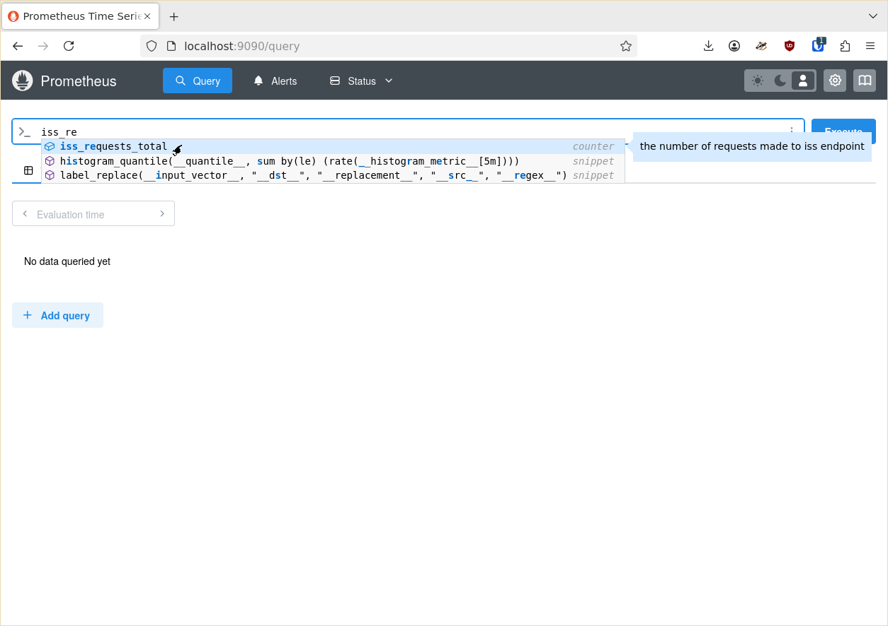.

If you select `iss_requests_total` and click `Execute`, you should now be able to see your metric:

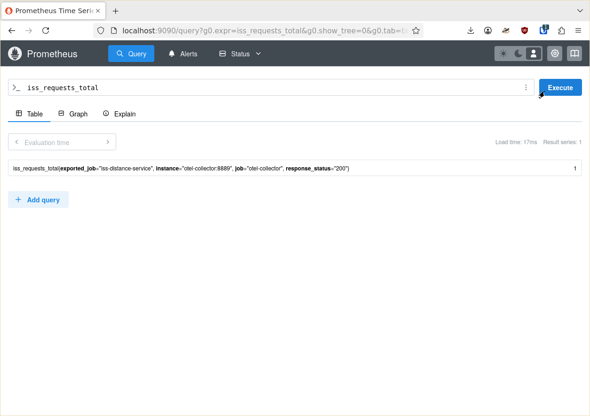

Make a few more requests, you should see the counter increase!

We can also query our metrics in Grafana, using Prometheus as a data source. First, open the
[Explore section in Grafana](http://localhost:3000/explore). From there, select "Prometheus"
as the data source:

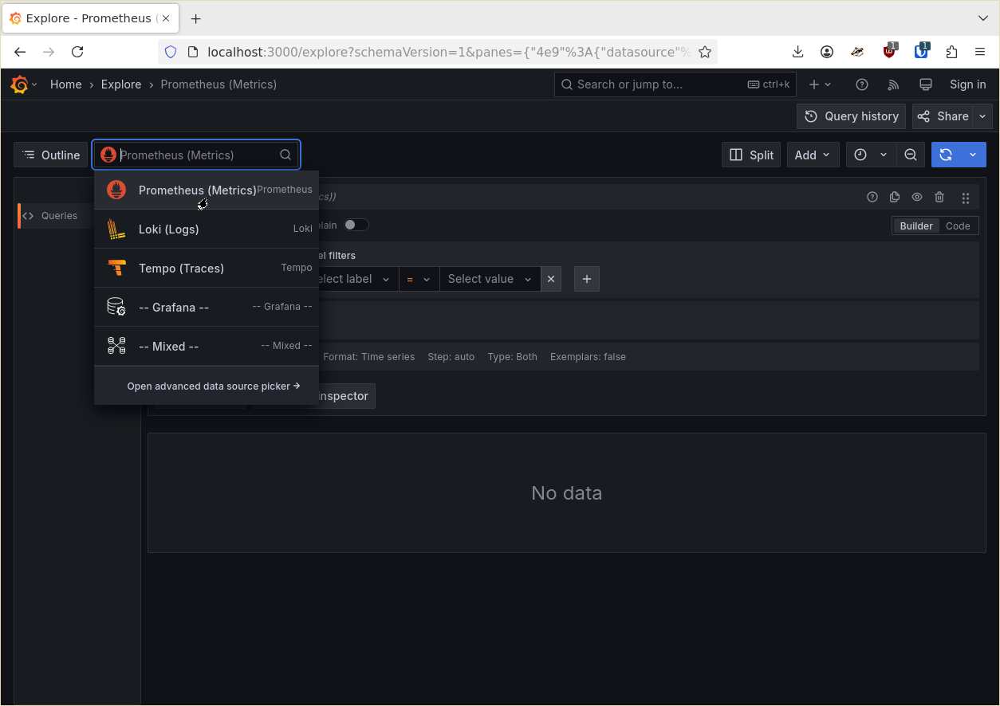

Selecting `iss_requests_total` and running the query will now show your metric.

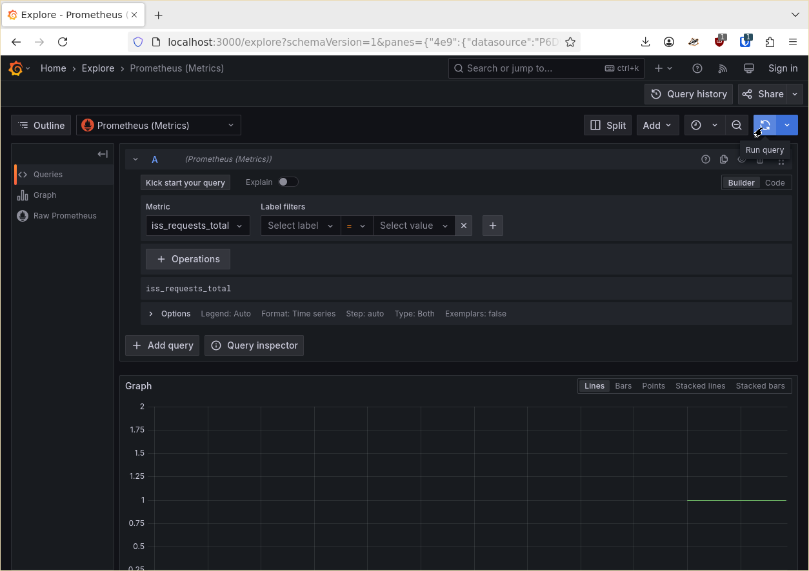

You should also explore any other metrics you added!

### Section 2: Logging

#### i. Set up logging

Again, some setup is required before we can create logs. 

Open up `backend/iss-distance-service/app.py` and add the following to the list of imports:

```python
import logging

from opentelemetry._logs import set_logger_provider
from opentelemetry.exporter.otlp.proto.grpc._log_exporter import OTLPLogExporter
from opentelemetry.sdk._logs import LoggerProvider, LoggingHandler
from opentelemetry.sdk._logs.export import SimpleLogRecordProcessor
```

Then, we'll then use these imports to set up the log `provider` and `exporter`. Create a `setup_logging` method, which accepts two arguments the `Resource` and a `Logger`, then add the following:

```python
def setup_logging(resource: Resource, logger: logging.Logger):
    """
    Sets up a logging provider that exports logs in batches, and attaches the OTLP handler
    to the given logger.
    """

    logger_provider = LoggerProvider(resource=resource)
    set_logger_provider(logger_provider)

    # 2. b. Set up logging exporter and handler
    exporter = OTLPLogExporter(insecure=True)
    handler = LoggingHandler(level=logging.NOTSET, logger_provider=logger_provider)
    logger_provider.add_log_record_processor(SimpleLogRecordProcessor(exporter))

    logger.addHandler(handler)
    logger.level = logging.DEBUG
```

This is quite a lot of setup and can seem a bit complicated. To deconstruct line by line what is happening:

```python
    logger_provider = LoggerProvider(resource=resource)
    set_logger_provider(logger_provider)
```

This creates a `LoggerProvider`, and registers it so the logger provider can be used.


```python
    exporter = OTLPLogExporter(insecure=True)
    handler = LoggingHandler(level=logging.NOTSET, logger_provider=logger_provider)
    logger_provider.add_log_record_processor(SimpleLogRecordProcessor(exporter))

```

This sets up the OTLP exporter to send logs over OTLP. It then sets up a logging handler to send logs in OTLP format to a destination. We then register a `LogRecordProcessor` on the provider, in this case we use a `SimpleLogRecordProcessor`, which exports logs as soon as they are emitted.

```python
    logger.addHandler(handler)
    logger.level = logging.DEBUG
```

This attaches the handler to the logger and sets the log level to `DEBUG`.

Finally, we can create a global `LOGGER` for our application to use, and call
the `setup_logging` method we've created above to attach our OTel functionality to it:

```python
LOGGER = logging.getLogger("iss-distance-service")
setup_logging(resource, LOGGER)
```

#### ii. Create logs

Now, you can add logs to various points in the application where you think it might be useful.
For example, you could add logs:

1. When the application is started: `LOGGER.info("started application")`
2. When no latitude or longitude is provided in the request: `LOGGER.warning("Missing latitude/longitude in request")`
3. When an incoming request is received: `LOGGER.info("received request from IP address: %s", request.remote_addr)`
4. When a non-200 response is returned from the ISS endpoint: `LOGGER.error("request to iss endpoint returned a non-200 response")`

#### iii. Explore logs with Grafana and Loki

Now that we are exporting logs, let's check they are being ingested. Again, open [Explore section in Grafana](http://localhost:3000/explore) and select "Loki" as the data source:

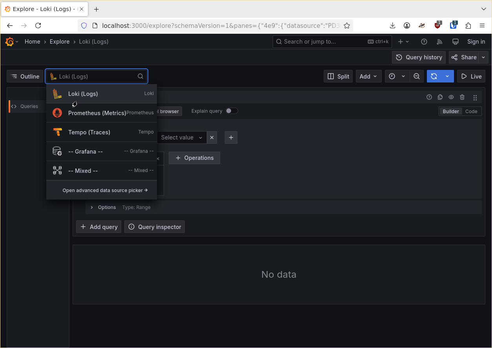

We should create a query for searching our logs. For now, let's query the `service_name`, which will
be `iss-distance-service`. If you execute the query, you should see a graph of your logs:

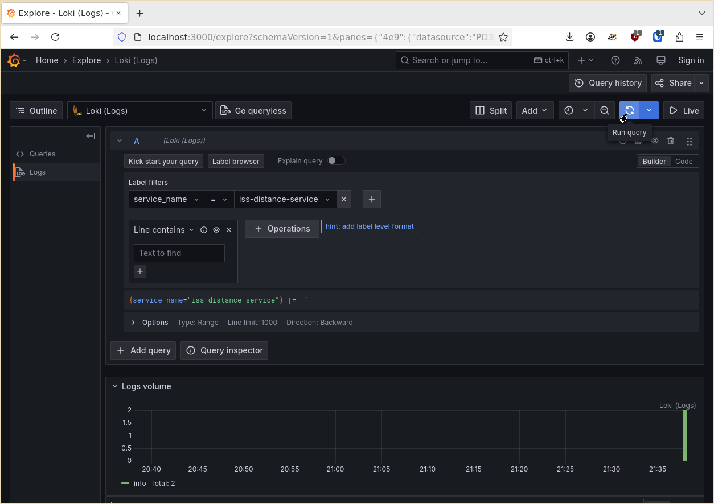

If you scroll down, you'll see individual log lines. These log lines can be expanded, and you
can see various attributes about the logs in question:

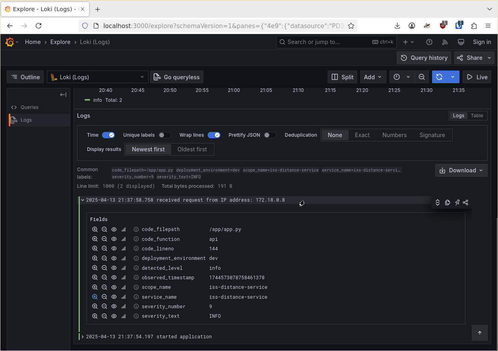

### Section 3: Tracing

#### i. Set up tracing

Like in the previous sections, we'll need to do some setup, before we can create traces.

Again, open up `backend/iss-distance-service/app.py`, and add the following to the list of imports:

```python
from opentelemetry.exporter.otlp.proto.grpc.trace_exporter import OTLPSpanExporter
from opentelemetry.trace import get_tracer_provider, set_tracer_provider, get_current_span, StatusCode
from opentelemetry.sdk.trace import TracerProvider
from opentelemetry.sdk.trace.export import SimpleSpanProcessor
```

Then, we'll then use these imports to set up the tracing `exporter` and `provider`. Create a `setup_tracing` method which accepts one argument of type, `Resource`, like so:

```python
def setup_tracing(resource:Resource):
    """
    Sets up tracing provider that exports spans as soon as they are resolved, and
    assigns it to be the global trace provider.
    """

    span_exporter = OTLPSpanExporter(insecure=True)
    span_processor = SimpleSpanProcessor(span_exporter)
    trace_provider = TracerProvider(resource=resource)
    trace_provider.add_span_processor(span_processor)
    set_tracer_provider(trace_provider)
```

This is a lot of new additions in just a few short lines! Let's pause to take a look at what each of these does: 

- `OTLPSpanExporter` - this is a span exporter. It exports spans to the OpenTelemetry Collector using the OpenTelemetry Protocol (OTLP).
- `TracerProvider` - the provider manages and provides a `tracer` instance. This is used to create spans for distributed tracing.
- `SimpleSpanProcessor` - the span processor exports spans to the `OTLPSpanExporter`. It exports them immediately as they're generated. We use this form of `Processor` for simplicity, but in production applications, you would typically use a `BatchSpanProcessor`.

Next, outside of any methods, we call the method we've created above to setup tracing, and then create a `tracer` which will be used to create spans:

```python
setup_tracing(resource)

tracer = trace.get_tracer_provider().get_tracer(__name__)
```

#### ii. Create spans

Now that we have the setup in place, we can begin capturing useful information.

On the `api` function, we can create the first `span`.

> **Note**
>
> At this point, it's worth explaining the relationship between `span`s and `trace`s, and what they represent.
>
> A `span` represents a unit of work or an operation that occurs as part of the journey
a request takes through an application. These could be HTTP requests to other services,
requests to third parties, database queries, etc. Spans can also be nested - a large span that represents one large unit of work might contain nested within it several smaller spans that represent smaller units of work that make up the whole.
>
> A `trace` is a collection of `span`s that, altogether, represent the journey a request takes through an entire application. It provides a view of the journey as the request flows through different services and parts of the application.


We would like to know when a request is made to the `iss-distance-service`, and how long the request takes.

There are two ways to capture an OpenTelemtry span i. using a method decorator or ii. using `with`. In this example we will use both.

Add the following `with tracer.start_as_current_span` block to the `api` method, giving the span a suitable name e.g. `"calculating-api-distance"`:

```python
def api():

    # Starting a new span from the tracer
    with tracer.start_as_current_span("<PLACEHOLDER-SPAN-NAME>") as span:
        incoming_request_counter.add(1)
        LOGGER.info("received request from IP address: %s", request.remote_addr)


        latitude = request.args.get("latitude")
        longitude = request.args.get("longitude")

        ...
```

We would also like to know when a request is made to the `iss_now` API. To know this, we will create a span when this is called. Add the following decorator to the `get_iss_coordinates` method, giving the span a suitable name e.g. `getting-iss-coordinates`, in order to create a `nested span`:

```python

# Starting a new span from the tracer
@tracer.start_as_current_span("<PLACEHOLDER-SPAN-NAME>")
def get_iss_coordinates() -> Coordinates:
    ...
```

#### iii. Add span attributes

Attributes can be used to add additional metadata information to a span. This information can then be used
when exploring traces and allows you to do things such as grouping or filtering.

If the status code from the request to get the ISS coordinates is successful, we
can set a `span attribute` to capture the coordinates returned, as well as setting
the span's status to `ERROR` if anything fails:

```python
@tracer.start_as_current_span("getting-iss-coordinates")
def get_iss_coordinates() -> Coordinates:
        r = requests.get(ISS_NOW_URL)

        # Getting the current span
        span = get_current_span()

        if r.status_code == 200:
            position = r.json().get("iss_position")
            if position:
                coordinates = Coordinates(float(position.get("latitude")), float(position.get("longitude")))

                # Setting the iss.position attribute to be the returned coordinates
                span.set_attribute("iss.position", str(coordinates))
                return coordinates

        # Setting the span's status to ERROR if anything has failed
        span.set_status(StatusCode.ERROR)
        LOGGER.error("request to iss endpoint returned a non-200 response")
        return Coordinates(0, 0)
```

Because there are some forms of data that are typically useful to capture, there
are `Semantic Attributes` which allow the attributes to be defined in a consistent way. We will use semantic attributes to capture the request method, status and url:

Import the following:
```python
from opentelemetry.semconv.trace import SpanAttributes
```

We can now add attributes to the span, for example after we make a request to `ISS_NOW_URL`:

```python

@tracer.start_as_current_span("getting-iss-coordinates")
def get_iss_coordinates() -> Coordinates:
        r = requests.get(ISS_NOW_URL)

        # Getting the current span
        span = get_current_span()

        span.set_attribute(SpanAttributes.HTTP_METHOD, "GET")
        span.set_attribute(SpanAttributes.HTTP_STATUS, r.status_code)
        span.set_attribute(SpanAttributes.HTTP_URL, iss_now_url)

        ...
```

Finally, we can handle error cases in the `api()` by setting a span status:

```python

def api():

    # Starting a new span from the tracer
    with tracer.start_as_current_span("<PLACEHOLDER-SPAN-NAME>") as span:
        incoming_request_counter.add(1)
        LOGGER.info("received request from IP address: %s", request.remote_addr)


        latitude = request.args.get("latitude")
        longitude = request.args.get("longitude")

        if latitude and longitude:
            ...
        else:

            # Set the span's status code to an error
            span.set_status(StatusCode.ERROR)
            return f"No latitude/longitude given", 400

```

#### iv. Explore traces with Grafana and Tempo

Now that we are exporting traces, let's check they are being ingested. Again, open [Explore section in Grafana](http://localhost:3000/explore) and select "Tempo" as the data source:

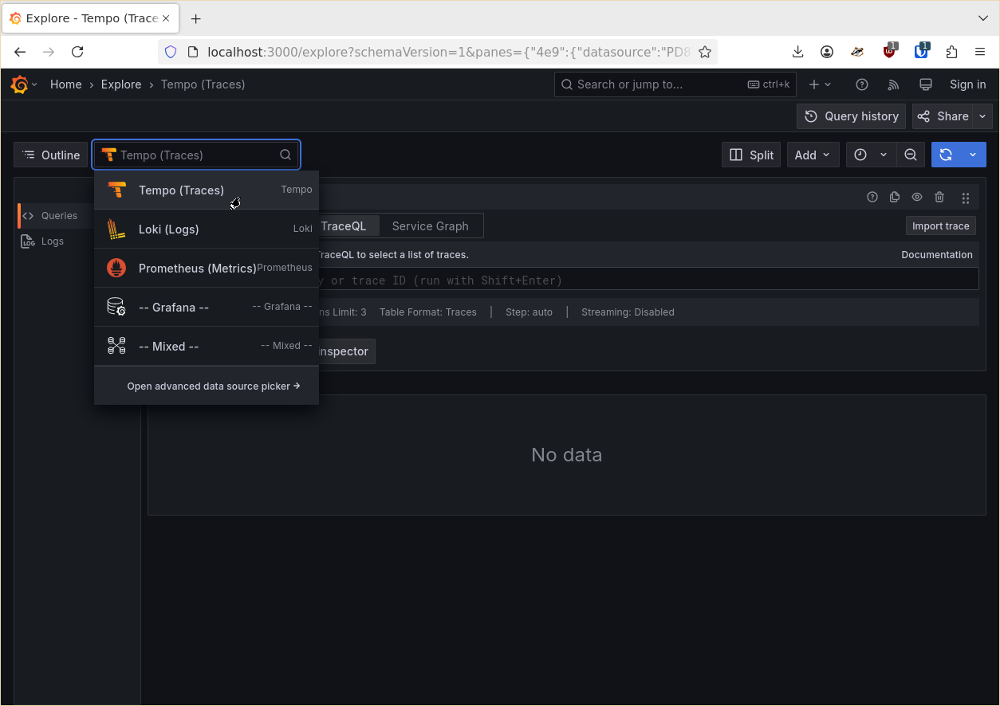

Let's create a basic `Search` query, filtering on the service name `iss-distance-service`. You should
see the traces being exported from your service.

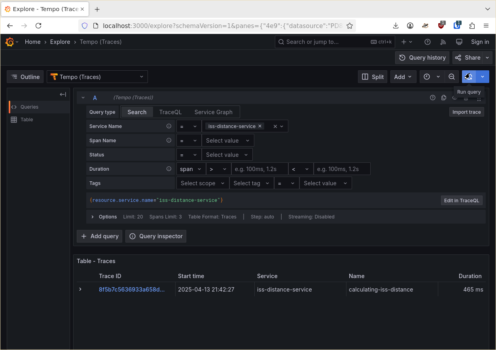

If you open a trace ID from the result in a new tab, you'll be able to see some detail about the trace:

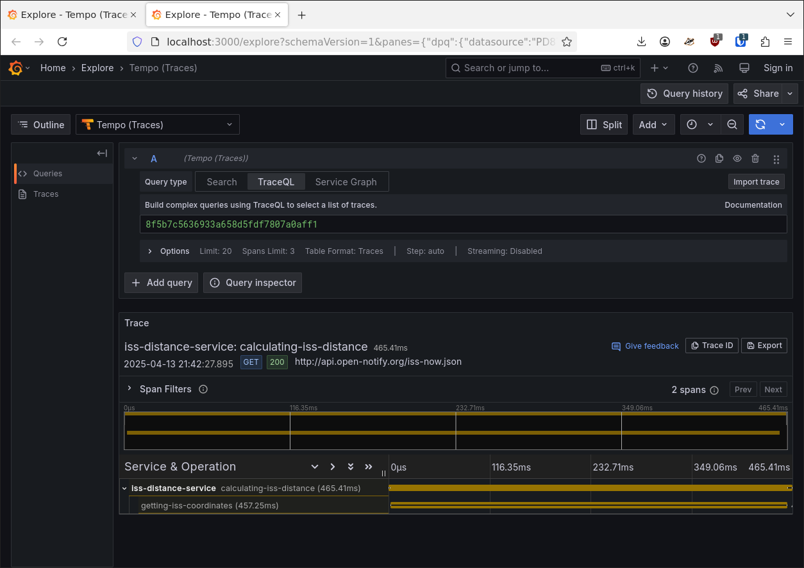

You can see that the trace is made up of spans. You can expand one of the spans to see the extra
attributes you assigned to it:

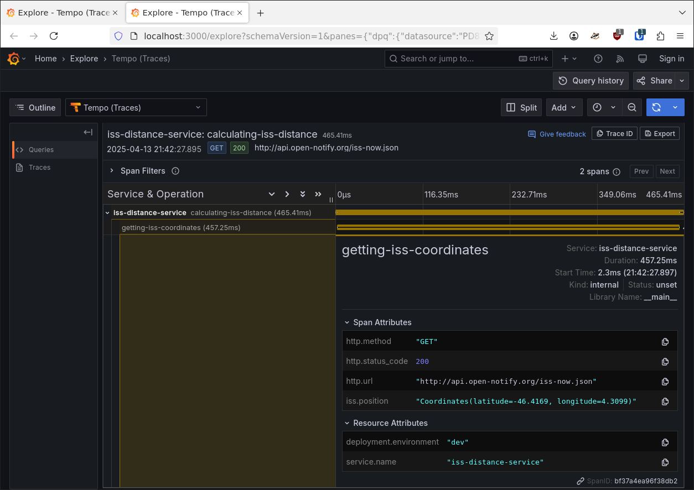

### Section 4: Distributed Tracing

Distributed tracing allows us to visualize and explore the request flow through the whole stack.

For distributed tracing across our services, we'll need to follow a similar process to what we used in the previous section
to set up tracing for the `iss-distance-service`. It is a little bit repetitive, but once we're done we'll be able to see the
request flow through the stack!

#### i. ISS Distance Service

Before instrumenting the other services, we need to make a small addition to this service to support trace propagation using Flask.

Open up `backend/iss-distance-service/app.py`, and add the following to the list of imports:

```python
from opentelemetry.instrumentation.flask import FlaskInstrumentor
```

The [FlaskInstrumentor](https://opentelemetry-python-contrib.readthedocs.io/en/latest/instrumentation/flask/flask.html) provides telemetry to track requests made in Flask applications and is an example of [auto-instrumentation](https://opentelemetry.io/docs/zero-code/python/), or automatic instrumentation. We could do this manually by propagating and extracting trace IDs from the request headers, but this is brittle and tedious - the Flask autoinstrumentor provides us this functionality for free.

This is the only change we need to make to this service, which means we can move on to the others.

#### ii. Gateway Service

To instrument the Gateway Service with tracing, we need to follow much the same process as before. Hopefully some of this will start to feel familiar.

Open up `backend/gateway/app.py`, and add the following to the list of imports:

```python
from opentelemetry.sdk.resources import DEPLOYMENT_ENVIRONMENT, SERVICE_NAME, Resource

from opentelemetry.exporter.otlp.proto.grpc.trace_exporter import OTLPSpanExporter
from opentelemetry.trace import get_tracer_provider, set_tracer_provider, get_current_span, StatusCode
from opentelemetry.sdk.trace import TracerProvider
from opentelemetry.sdk.trace.export import SimpleSpanProcessor
from opentelemetry.semconv.trace import SpanAttributes

from opentelemetry.instrumentation.flask import FlaskInstrumentor
from opentelemetry.instrumentation.requests import RequestsInstrumentor
```

You might notice that we include one import that we haven't seen yet, `RequestsInstrumentor`. We add the [RequestsInstrumentor](https://opentelemetry-python-contrib.readthedocs.io/en/latest/instrumentation/requests/requests.html) in order to enable tracing of HTTP requests made by the [requests](https://docs.python-requests.org/en/latest/index.html) library. The requests autoinstrumentor adds the current trace/span ID to the HTTP request headers, so that it gets propagated to the target service. In this service, we use the `requests` library to make requests to our backends.

Then we set up the Resource, underneath the imports:

```python
resource = Resource(
    attributes={
        SERVICE_NAME: "gateway",
        DEPLOYMENT_ENVIRONMENT: "dev",
    }
)
````

Next we create a method for setting up tracing:

```python
def setup_tracing(resource:Resource):
    span_exporter = OTLPSpanExporter(insecure=True)
    span_processor = SimpleSpanProcessor(span_exporter)
    trace_provider = TracerProvider(resource=resource)
    trace_provider.add_span_processor(span_processor)
    set_tracer_provider(trace_provider)
```

After this, we can call the this method to setup tracing and create the tracer:

```python
setup_tracing(resource)
tracer = get_tracer_provider().get_tracer(__name__)
```

Finally, we can set up the Instrumentors:

```python
FlaskInstrumentor().instrument_app(app)
RequestsInstrumentor().instrument()
```

We can also add error handling at various points, e.g. when we don't receive a 200 response from an endpoint:

```python

span = get_current_span()

span.set_attribute("error.text", r.text)
span.set_status(StatusCode.ERROR)
```

#### iii. Geolocator Service

To setup tracing in the Geolocator Service, we can follow the exact
same steps as we followed for the `Gateway` service (but excluding the `RequestsInstrumentor`, since this is not needed by the Geolocator Service)!

Once all of the tracing has been set up make some requests via the frontend and go to the next step to visualize them!


#### iv. Explore propagated traces with Grafana

Let's head back to the [Explore section in Grafana](http://localhost:3000/explore) again,
and create a `Search` query from the Tempo data source. You should see that the service
associated with the span is no longer `iss-distance-service` but `gateway` - this is
the service that began the trace.

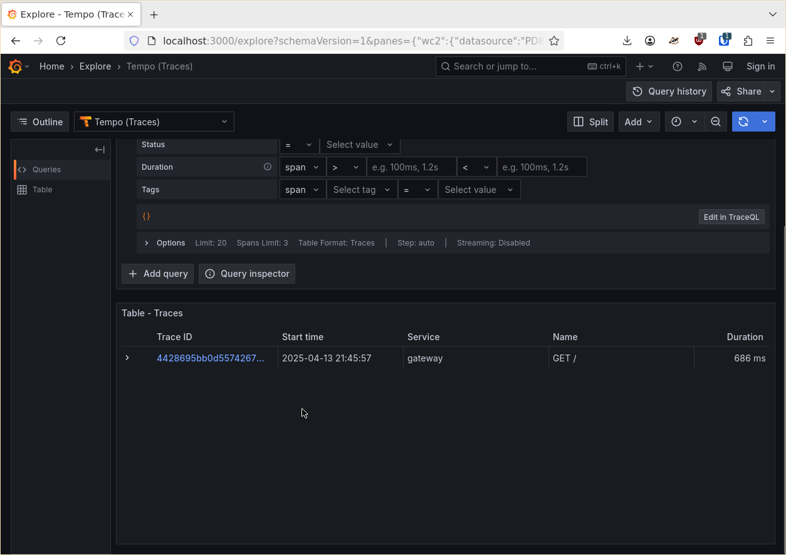

Opening the trace in a new tab will give you more detail:

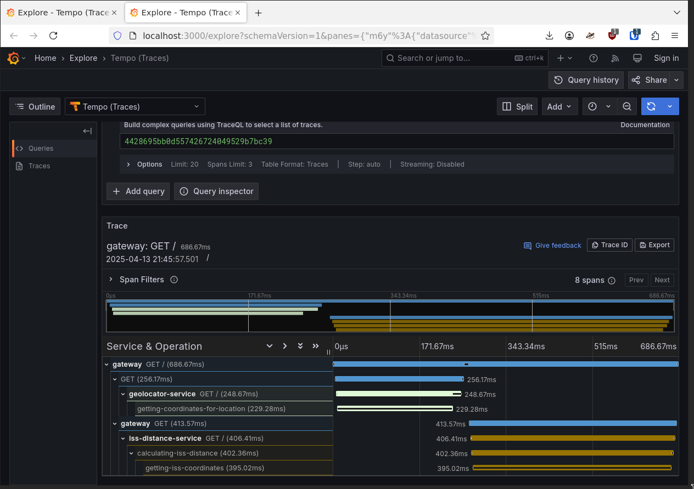

You can now see how the trace is composed of multiple spans from *different services*, colour
coded. We can now see the whole path a request makes through our system, and how long it spends
in each span. We can see from detail above that our request spent most of its time in getting
the ISS coordinates, with a smaller amount of time spent resolving the coordinates of a given
location.

If you have time, you could add the same tracing code to the `frontend service`, so see the
entire request flow starting from the frontend!
